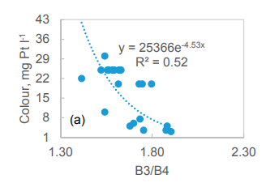

```{r, load_refs, include=FALSE, cache=FALSE}
library(RefManageR)
BibOptions(check.entries = FALSE,
           bib.style = "authoryear",
           cite.style = "authoryear",
           style = "markdown",
           hyperlink = TRUE,
           dashed = FALSE,
           no.print.fields=c("doi", "urldate", "issn"))
myBib <- ReadBib("references.bib", check = FALSE)
```    

class: inverse, center, middle

# Sentinel-2

```{r echo=FALSE, out.width='60%', fig.align='center'}
knitr::include_graphics('img/Sentinel-2-MSI_overview.jpg')
```

(Source: [European Space Agency](https://sentinels.copernicus.eu/web/sentinel/user-guides/sentinel-2-msi/overview))


---


# Summary (1)

Sentinel-2 is a "wide swath, high resolution, multi-spectral imaging mission" operated by the European Space Agency (ESA) `r Citep(myBib,"european_space_agency_sentinel-2_2023-2")`. It contributes to applications in areas such as climate change, land monitoring, emergency management, and security (ibid.).

The following areas have been listed as being covered as part of the Observation Scenario for the mission (ibid.). 

- all continental areas (including inland waters) between latitudes 84 degrees North and 56 degrees South
- all coastal waters up to 20km from shore 
- all islands belonging to the EU
- the Mediterranean Sea
- all closed seas

---

# Summary (2) 

.pull-left[
There are two identical satelites, Sentinel 2A (launched 23 June 2015) and Sentinel 2B (launched 7 March 2017) . They each have a with a swath width of 290km and operate simultaneously in the same orbit phased at 180 degrees `r Citep(myBib,"european_space_agency_sentinel-2_2023")`. The MultiSpectral Instrument (MSI) of the satelite operates by passively collecting sunlight reflected from the earth. By passing a filter the light is focused on two focal plane assemblies, one for Visible and Near-Infra-Red bands and the other for Short Wave-Infra-Red bands (ibid) `r Citep(myBib,"european_space_agency_sentinel-2_2023-1", "european_space_agency_sentinel-2_2023-2")`. 
]

.pull-right[

.center[**View on Equator**]

```{r echo=FALSE, out.width='60%', fig.align='center'}

```

.center[The Twin-Satellite SENTINEL-2 Orbitual Confuguration (courtesy Astrium GmbH) 

(Source: [European Space Agency](https://sentinels.copernicus.eu/web/sentinel/user-guides/sentinel-2-msi/overview))
]
]


---

# Summary (3)

There are 13 spectral bands collected by the MSI at three different spatial resolutions, presented in detail in the figure below. The data is available to users via images divided into 100km tiles at two different levels (Level-1C and Level 2A) depending on corrections `r Citep(myBib,"european_space_agency_sentinel-2_2023")`.

```{r echo=FALSE, out.width='60%', fig.align='center'}

```

.center[Wavelengths and Bandwidths of the three Spatial Resolutions of the MSI instrument (Source: [European Space Agency](https://sentinels.copernicus.eu/ar/web/sentinel/missions/sentinel-2/instrument-payload/resolution-and-swath))]

---

# Applications

## Policy

One of the notable policy applications of Sentinel Data is for the Senitnels for Common Agriculture Policy (Sen4CAP) project. 
The SEN4CAP is operated by the European Space Agency along with DG-Agri, DG-Grow and DG-JRC of the European Commission `r Citep(myBib,"european_space_agency_sen4cap_2023")`. There is an particular interest in what the information derived from Sentinel provides for the modernisation and simplification of the CAP in the future (ibid.). 

One of the notable achievements within this project is the development of a new monitoring approach that has allowed for the replacement of physical visits of farms that was previously necessary for the EU to issue payments `r Citep(myBib,"european_space_agency_sentinels_2018")`. It is said that the usage of earth observation data for monitoring satellite technology will lessen the amount of stress for the farmers (ibid.). 

---

# Applications 

## Academic Research
Sentinel-2 data has also been utilised in academic research. For example, `r Citet(myBib,"toming_first_2016")` have examined how suitable the information derived from Sentinel-2's MSI is for mapping parameters for the quality of lake water in 9 small and 2 small lakes in Estonia. The comparison between the data collected on chlorophyll a, water colour, colored dissolved organic matter and dissolved organic carbon with the Sentinel-2 MSI data demonstrated good correlation with high R<sup>2</sup> values. This indicates the utility of Sentinel-2 data for lake monitoring purposes, based on the availability of data for long periods and frequent and free updates of the imagery (ibid.).

---

Correlation between the field samples and the height of 705nm peak for chlorophyll a (chl a, top left) and the ratio of bands 3 and 4 for water colour (top right), colored dissolved organic matter (CDOM, bottom left) and dissolved organic carbon (DOC, bottom right) from Sentinel-2 data `r Citep(myBib,"toming_first_2016")`

.column[


]

.column[


]
---

# Reflections

I found the application of Sentinel-2 data for a EU-wide policy framework particularly interesting. The exploration of outer space including the launch of satelites historically has been associated with nationalism, particularly represented in the Space Race during the Cold War Period `r Citet(myBib,"kallen_nationalism_2019")`. However, the whole operation of Sentinel 2 may be thought of a representation of "Europeanisation" of the space industry, hence its application to a regional interest `r Citet(myBib,"patarin-jossec_materialising_2020")`. At the same time, the utility of remote sensing images for global frameworks is being increasingly recognised, such as the sustainable development goals `r Citet(myBib,"copernicus_how_2018")`. It is interesting to consider the various interests involved in both the production and usage of remote sensing imagery. 

---

# References

```{r, results='asis', echo=FALSE}
PrintBibliography(myBib, start = 1, end = 5)
```

---

# References

```{r, results='asis', echo=FALSE}
PrintBibliography(myBib, start = 6, end = 9)
```


